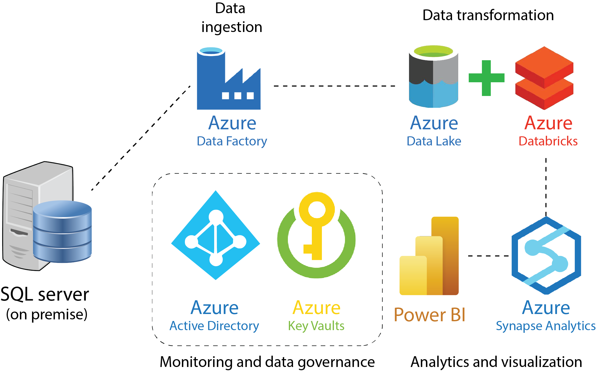

# Azure end to end pipeline

## Introduction

The use case for this project is building an end to end solution by ingesting the tables from on-premise SQL Server database using Azure Data Factory and then storing the data in Azure Data Lake. Azure databricks is used for data transformation. Microsoft Power BI is integrated with Azure synapse analytics to build an interactive dashboard. Azure Active Directory (AAD) and Azure Key Vaults are used for the monitoring and data governance.

  

## Pipeline development

The first step in developing a pipeline on Azure is to create a resource group that houses all the resources that will be used in the project.

## Overview of Azure Services used

### 1. Azure Data Factory

**Description:**
Azure Data Factory is a cloud-based data integration service that allows you to create data-driven workflows for orchestrating and automating data movement and data transformation. It enables seamless data orchestration and transformation at scale.

**Key Features:**
- **Data Pipelines:** Define and schedule data-driven workflows, known as pipelines.
- **Data Movement:** Efficiently move data between on-premises and cloud environments.
- **Data Transformation:** Transform and process data using compute services such as Azure HDInsight Hadoop, Spark, Azure Data Lake Analytics, and Azure Machine Learning.

---

### 2. Azure Synapse Analytics

**Description:**
Azure Synapse Analytics (formerly SQL Data Warehouse) is an integrated analytics service that brings together big data and data warehousing. It allows users to analyze large volumes of data with both on-demand and provisioned resources.

**Key Features:**
- **Data Warehousing:** Store and analyze large volumes of relational data with high-performance analytics.
- **Big Data Integration:** Integrate big data and data warehouse solutions for comprehensive analytics.
- **Security and Compliance:** Implement robust security features and comply with regulatory requirements.

---

### 3. Azure Databricks

**Description:**
Azure Databricks is a fast, easy, and collaborative Apache Spark-based analytics platform. It provides an environment for big data analytics and machine learning, fostering collaboration between data scientists, data engineers, and business analysts.

**Key Features:**
- **Unified Analytics Platform:** Collaborative environment for data preparation, exploration, and machine learning.
- **Scalability:** Easily scale resources to handle large datasets and complex analytics workloads.
- **Integration:** Seamless integration with other Azure services and popular data science tools.

---

### 4. Azure Data Lake

**Description:**
Azure Data Lake Storage is a scalable and secure data lake that allows organizations to store and analyze massive amounts of data in the cloud. It is designed for big data analytics and supports a wide range of analytics and machine learning workloads.

**Key Features:**
- **Scalability:** Store and analyze petabytes of data with ease.
- **Security and Compliance:** Implement fine-grained access controls and meet compliance standards.
- **Analytics:** Perform complex analytics using Azure Databricks, HDInsight, and other services.

---

### 5. Azure Active Directory

**Description:**
Azure Active Directory (Azure AD) is a comprehensive identity and access management service provided by Microsoft Azure. It helps your employees sign in and access resources, whether they are on-premises or in the cloud.

**Key Features:**
- **Single Sign-On (SSO):** Enable users to access multiple applications with a single set of credentials.
- **Multi-Factor Authentication:** Add an extra layer of security with multi-factor authentication.
- **Application Integration:** Integrate with thousands of pre-built applications and custom applications.

---

### 6. Azure Key Vaults

**Description:**
Azure Key Vault is a cloud service that safeguards cryptographic keys and secrets used by cloud applications and services. It helps secure sensitive information and simplifies key management.

**Key Features:**
- **Key Management:** Safely store and manage sensitive information like encryption keys, secrets, and certificates.
- **Access Control:** Control and monitor access to keys and secrets.
- **Integration:** Seamlessly integrate with Azure services and custom applications.

---

### 7. Power BI

**Description:**
Power BI is a suite of business analytics tools that enables organizations to visualize their data and share insights across the organization or embed them in an app or website.

**Key Features:**
- **Data Visualization:** Create interactive and compelling visualizations from various data sources.
- **Data Exploration:** Analyze data trends, patterns, and outliers.
- **Collaboration:** Share reports and dashboards with stakeholders and collaborate in real-time.

## Notes:

- In setting up storage, make sure to enable **hierarchical namespace** since enabling the Hierarchical Namespace in Azure Storage enhances data organization, improves compatibility with existing tools and frameworks, and provides benefits for big data analytics workloads. It is particularly useful for organizations dealing with large-scale data storage and processing requirements.